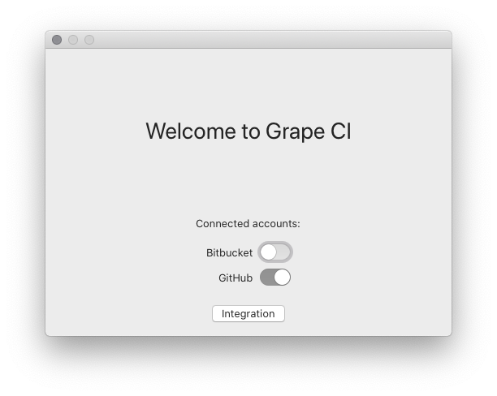
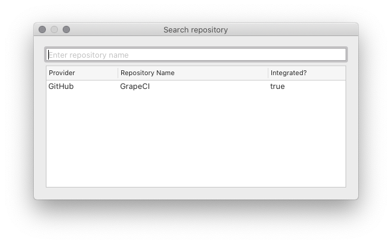
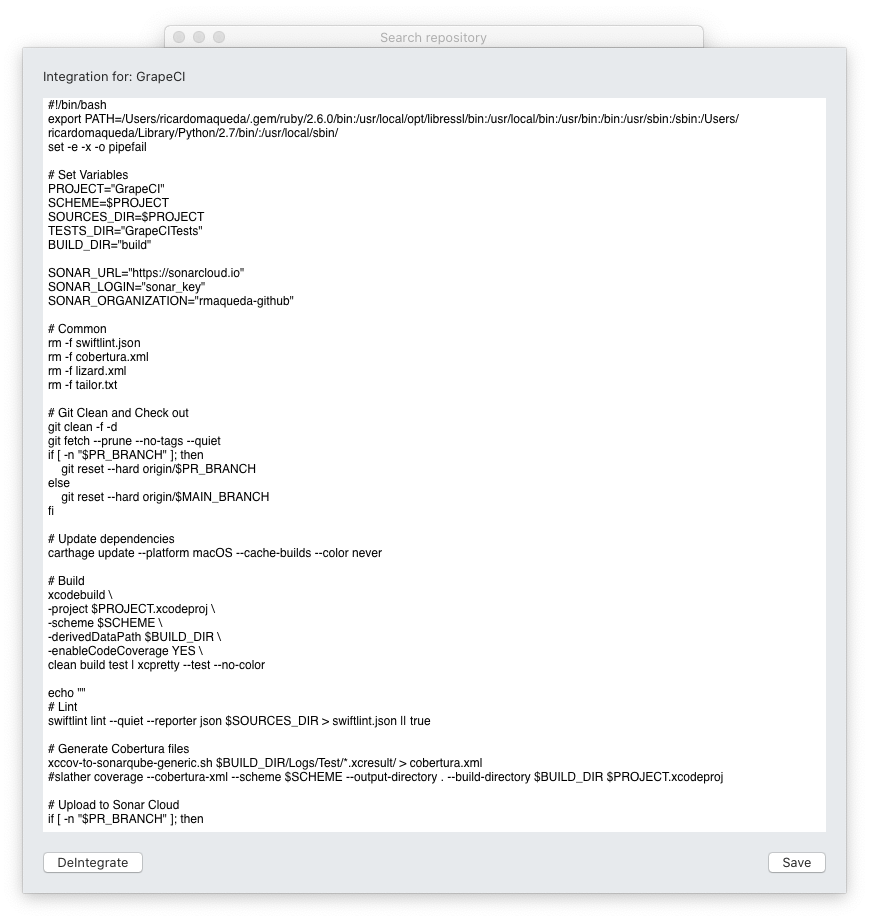
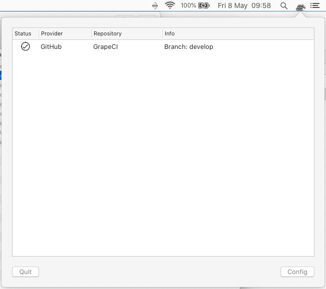

## How to use it

1. First, you need to **login** into Github, Bitbucket or both, the login screen is open automatically the first time, or you can go again clicking on the status icon and then **Config**

2. You need to add a repository, pressing on **Integration** button

The list shows the currently integrated repository and a TextField to search a new one

3. Click on one repository to open the integration screen, write (I suggest to edit the script on your favourite editor and paste here):

4. Press **Save**.

5. Grape clones the repository and start working with it.

6. You can press the app icon to see the status.

7. You can see the log of the build clicking on the status icon:

