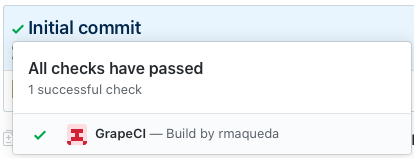
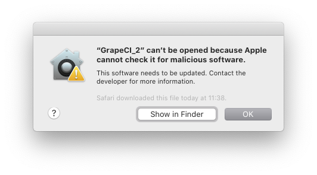

### GRAPECI

### Metrics [Sonar Cloud](https://sonarcloud.io/dashboard?id=GrapeCI)

      

   

## What is GrapeCI?

It's a work in progress, **serverless**, continuous integration software written in Swift.

Connect your Bitbucket or GitHub accounts and set up a build script for yours repository.
GrapeCI launch the build script when these changes are detected:

* New commit on the default branch
* New commit on a pull request

When the build script finish, a build status is created for this commit. 
Like this one: 

## How to install?

Easy way:

* [Download](https://raw.githubusercontent.com/rmaqueda/GrapeCI/develop/Archive/GrapeCI-1.0.0.zip), unzip and run.
* If you see this security alert. Go to: *Preferences -> Security* and allow run GrapeCI.
This is because GrapeCI needs run without sandbox in order to run the pipelines.

	
	

Build by yourself:

* Update dependencies with Carthage
* Open Xcode project
* Edit the GrapeCI scheme and write the oauth secrets enviroment varialbes (You will need to setup the aouth configuration firstly on [Github](https://github.com/settings/applications/new) or [Bitbucket](https://developer.atlassian.com/cloud/bitbucket/oauth-2/))
* Run or Archive the project

## How to use it?

Take a look to this [guide](./Documentation/HowToUseIt.md)

## Build script

To create a custom builds for different scenarios, the build script receives these environment variables:

* REPOSITORY: Repository Name
* MAIN_BRANCH: The repository default branch 
* PROVIDER: GitHub or BitBucket
* PR_BRANCH: Destination branch name for pull request
* PR_BASE: Origin branch name for pull request
* PR_ID: Pull request identifier

The [documentation folder](./Documentation/PipelineExamples/) contains examples of build scripts for direcrent types of projects and tools:

* [MACOS](./Documentation/PipelineExamples/GrapeCI.sh)
* [iOS](./Documentation/PipelineExamples/OpenWeather.sh)
* [Command line tool](./Documentation/PipelineExamples/CryptoParrot.sh)

## Why am I building this?

* Learn Apple Combine, SwiftUI and how create a Mac App.
* Have a free and easy to setup continuous integration tool
* Have fun :)

## Do you want to contribute?

This would be great!

The project is an early state, if you think is useful for you or you want to contribute, do it 💪

## Dependencies

sudo gem install cocoapods
sudo gem install slather
sudo gem install xcpretty
brew install sonar-scanner
brew install carthage
brew install sourcery
